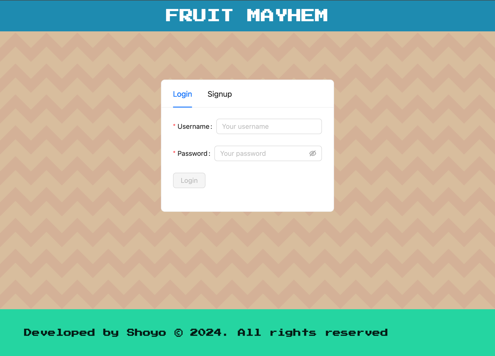
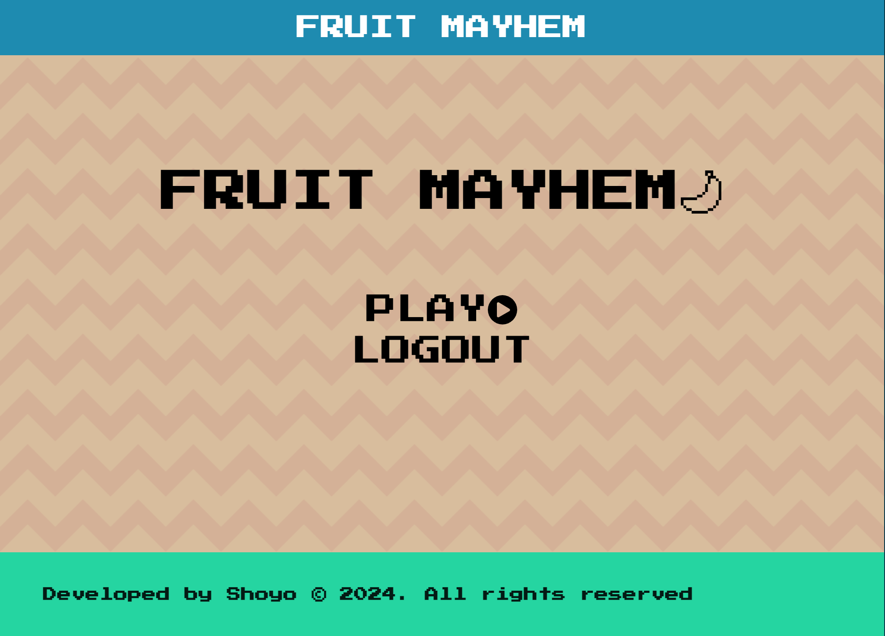
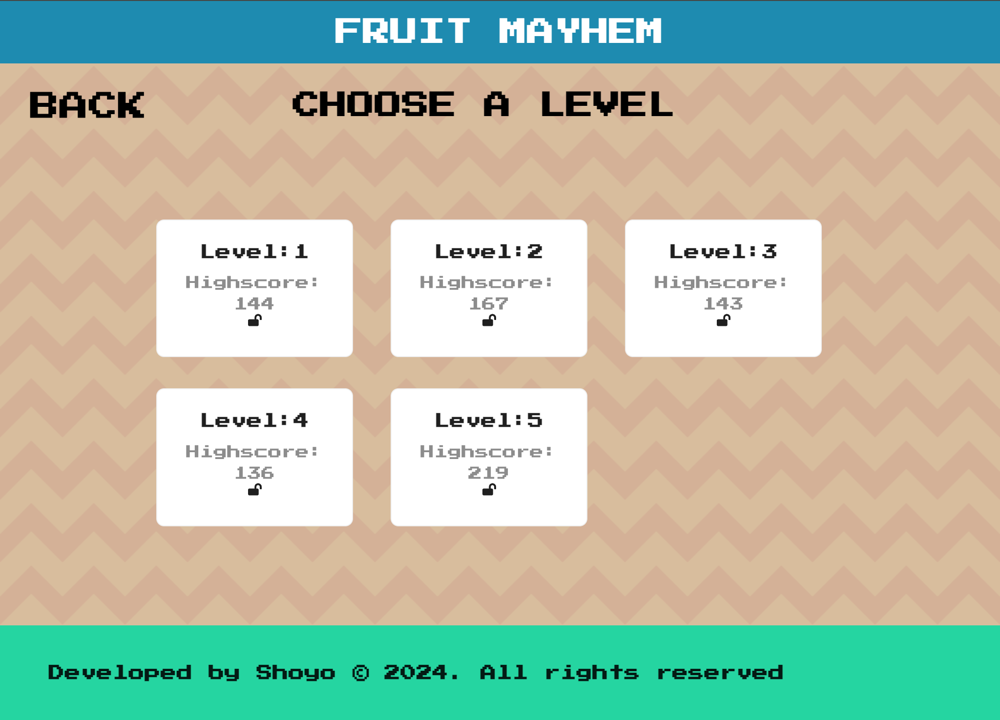
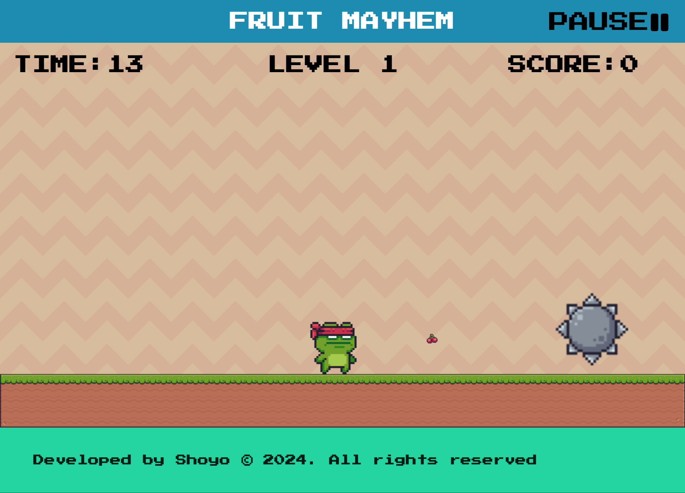

# FRUIT MAYHEM

## Description

"Fruit Mayhem" is fruit-catching game where your goal is to catch as many fruits as possible and beat the highscore. The game that uses simple game mechanics but also challenging the players reaction time. This was inspired by many retro arcade games that had simple game mechanics but at the same time was challenging

## Table of Contents

- [Screenshots](#screenshots)
- [Installation Guide](#installation)
- [Usage](#usage)
- [Credits](#credits)
- [License](#license)

## Screenshots

**Login page**


**Main Menu page**


**Level page**


**Game page**


## Installation

- Install independencies

```bash
npm i
npm run install
```

- Run application

```bash
npm run develop
```

## Usage

- Create a user to login in and play
- Unlock levels
- Beat each levels highscore
- See your progress

## Credits

The underlying technologies used in this game "Fruit Mayhem is React, MongoDB, GraphQL with Node.js and Express.js, Ant Design, and Phaser3

- [React](https://legacy.reactjs.org/docs/getting-started.html)
- [GraphQL and Apollo](https://www.apollographql.com/tutorials/)
- [Phaser](https://newdocs.phaser.io/docs/3.70.0)
- [Ant Design](https://ant.design/components/overview)
- [Ingame Assets from Pixel Frog](https://pixelfrog-assets.itch.io/pixel-adventure-1)

## License

This project is licensed under the MIT License.

## Link to Deployed Application

- [Render deployed application](https://react-game-fruit.onrender.com)
